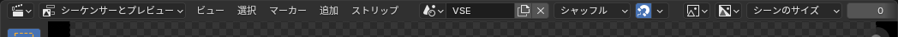
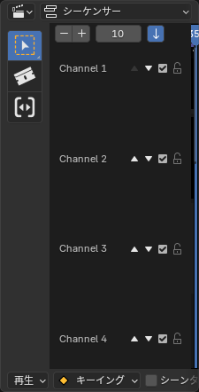

# VSE アップデート (2026-09-23)

Falcon Engine の Video Sequence Editor(VSE)へ、今回まとめて追加した機能の使い方です。
どれも Falcon Engine のビルドを起動すればそのまま使えます(追加のインストール操作は不要)。

## 1. ヘッダーの表示切り替え(秒/フレーム・チャンネル欄・解像度・チャンネル番号)

今まで `ビュー` / `プロキシ` メニューの奥にしかなく気付きにくかった4つの設定を、
ヘッダーに常時表示のボタン・欄として出しました。

左から:

- **時計アイコン** — 現在フレームの表示を「フレーム番号」⇔「タイムコード(秒)」で切り替え
- **チャンネル欄アイコン** — 左のチャンネル一覧パネルの開閉
- **プレビュー解像度**(画像のドロップダウン、既定「Scene」)— プレビューを縮小して表示速度を上げる
- **チャンネル番号**(数値欄、既定 0)— この番号以下のチャンネルだけをプレビューに表示

いずれもクリックするだけで、設定自体は既存の Blender の機能です(今まで見えにくかっただけ)。

## 2. チャンネルの前後入れ替え

左のチャンネル一覧パネル(上の①で開閉)の各行に、上下の矢印ボタンを追加しました。

矢印を押すと、隣のチャンネルとストリップの中身をまるごと交換します(時間位置はそのまま)。
Blender の仕様上、チャンネル番号が大きいほど手前(上)に表示されるので、
「どの映像を手前に出すか」をドラッグ&ドロップなしで素早く切り替えられます。

矢印は常に「画面の上/下」を指すので、チャンネル並びを反転している場合(上下反転ボタン)でも
迷わず使えます。

## 3. プレビューでハンドルをドラッグしてクロップ(BL Easy Crop)

サードパーティ製アドオン **[BL Easy Crop](https://github.com/usrname0/BL_EasyCrop)**
(作者: usrname0、GNU General Public License v3.0 or later)を同梱し、既定で有効にしました。

使い方:

1. プレビューでクロップしたいストリップを選択
2. `Shift + C` を押す(または左のツールバーからクロップツールを選択)
3. 表示されたハンドルをドラッグして範囲を決める

今までの「数値を4つ手入力する」クロップに比べて、直感的に調整できます。

## 4. 追加した映像も自動でスムーズに再生(プロキシの自動化)

以前から入っていた「VSE Proxy Helper」(プレビュー用に軽いプロキシを自動生成する仕組み)が、
**16bit の画像連番(PNG など)に対して正しく動くように修正**しました。

使い方は変わりません:

1. 編集の最初に、サイドバー `Strip > Proxy Settings` から
   **「Set Up Proxies for Playback」**を1回押す
2. 以降にタイムラインへ追加した動画・画像連番は、裏で自動的に軽量プロキシが作られる
   (`プロキシ` という言葉を意識する必要はありません)

これまで 16bit の画像連番だけはこの仕組みが正しく機能せず、追加するたびに再生が
重いままでした。この修正でどの素材でも同じように「1回設定すれば、あとは何を足しても
スムーズ」になります。

## 5. 再生中に不具合が起きないための修正

- 再生中に Python から Strip を削除すると落ちる不具合を修正
- 再生開始直後に Strip 側の GPU 再生パスが正しく使われず、CPU 使用率だけ上がる不具合を修正

いずれも実機で複数回の動作確認済みです。詳しい経緯は
[Issue #10](https://github.com/Relrei/Falcon-Engine/issues/10) を参照してください。
